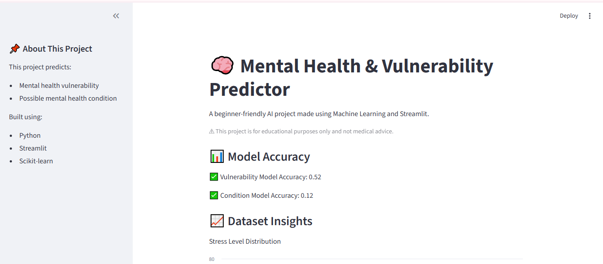
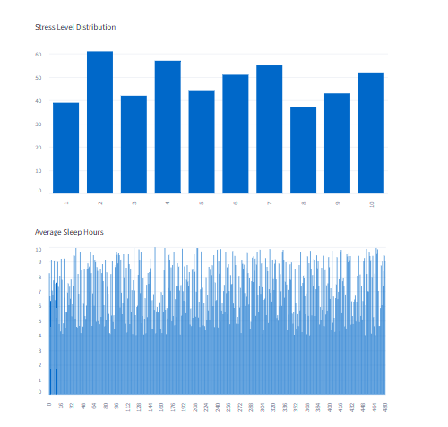
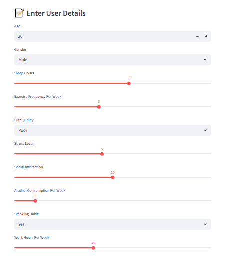
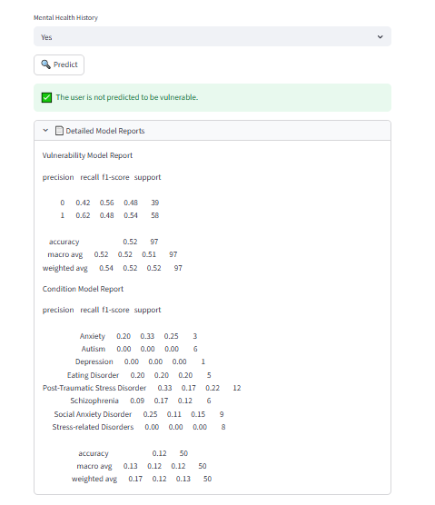

# 🧠 Mental Health & Vulnerability Predictor

A beginner-friendly Machine Learning project built using Python and Streamlit.

## 🌐 Live Demo

[Click Here to Open App](ai-mental-health-predictor.streamlit.app)

## 🚀 Features
- Predicts mental health vulnerability
- Predicts possible mental health condition
- Interactive Streamlit UI
- Dataset visualizations
- Helpful health suggestions

## 🛠 Technologies Used
- Python
- Streamlit
- Pandas
- Scikit-learn
- Random Forest Classifier

## 📊 Machine Learning Concepts Used
- Data Cleaning
- One Hot Encoding
- Train-Test Split
- Random Forest Classification
- Model Evaluation

## ▶ How to Run

Install dependencies:

```bash
pip install -r requirements.txt
```

Run the app:

```bash
streamlit run main2.py
```

## 📸 Screenshots

### 🏠 Home Page


### 📊 Dataset Insights


### 🤖 Prediction Result 1


### 🤖 Prediction Result 2


## ⚠ Disclaimer
This project is for educational purposes only and not medical advice.
